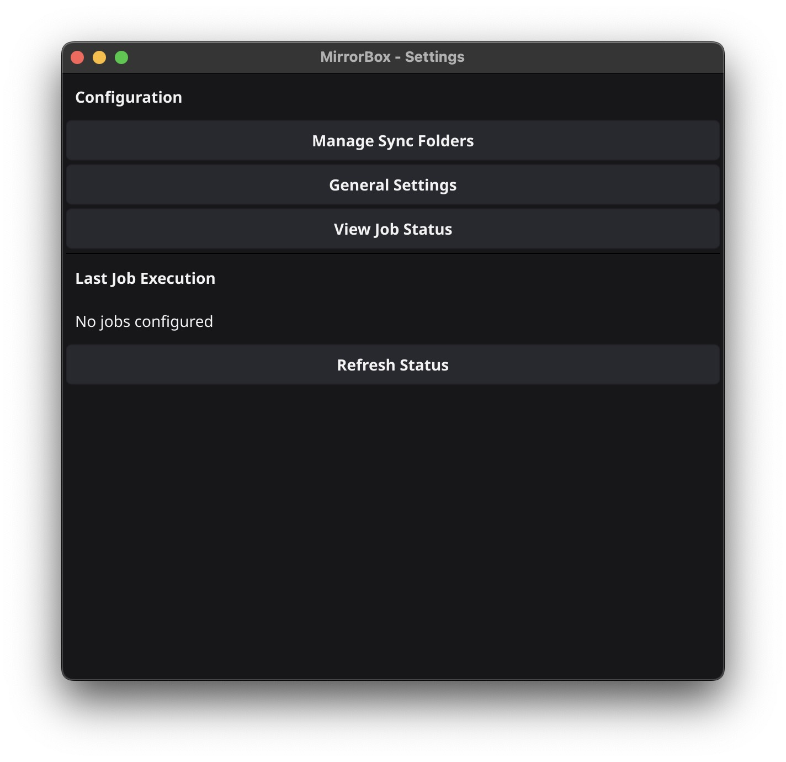
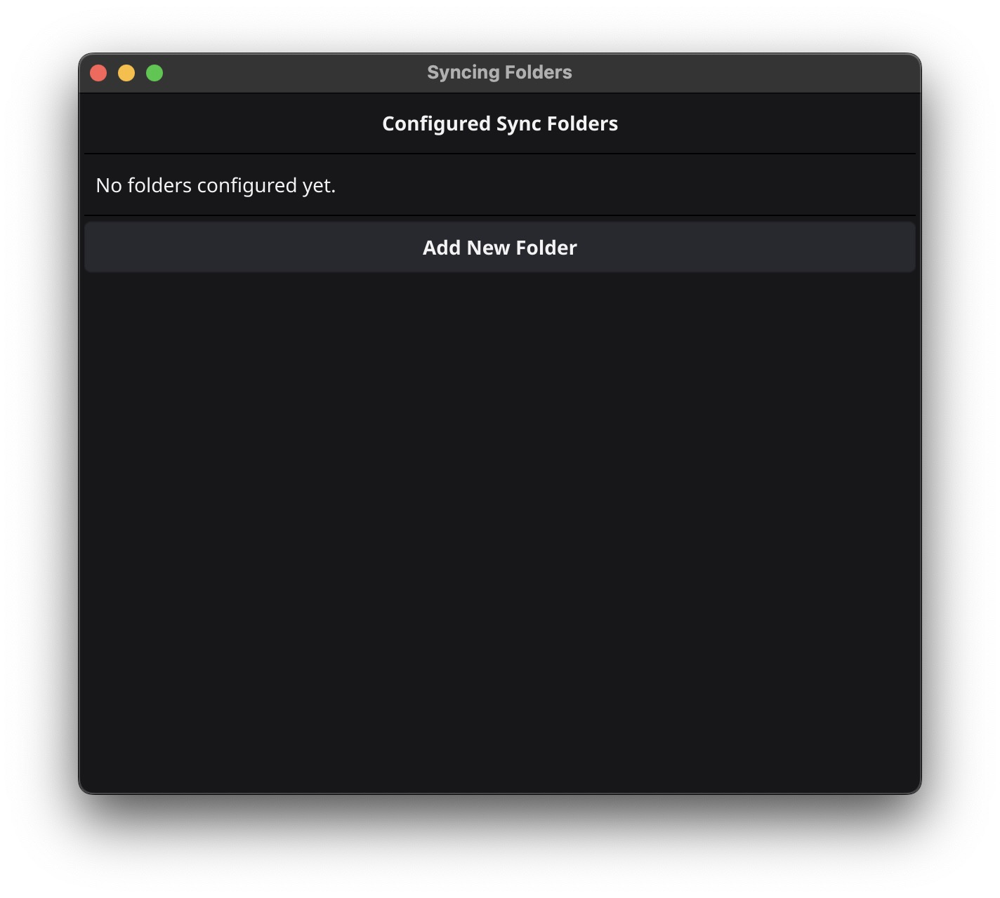
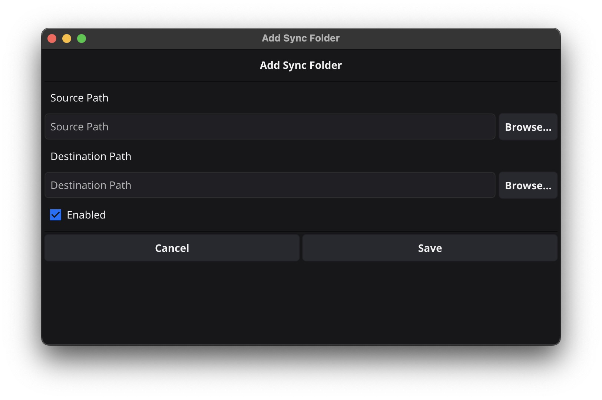

  

# MirrorBox

Cross platform tool to sync folders periodically

  

 

## Build & Run

1. Run the application

       go run ./src/cmd/app/main.go

1. Build package

        cd src/

        fyne package -name mirrorBox -os darwin -icon ./Icon.png ./cmd/app
